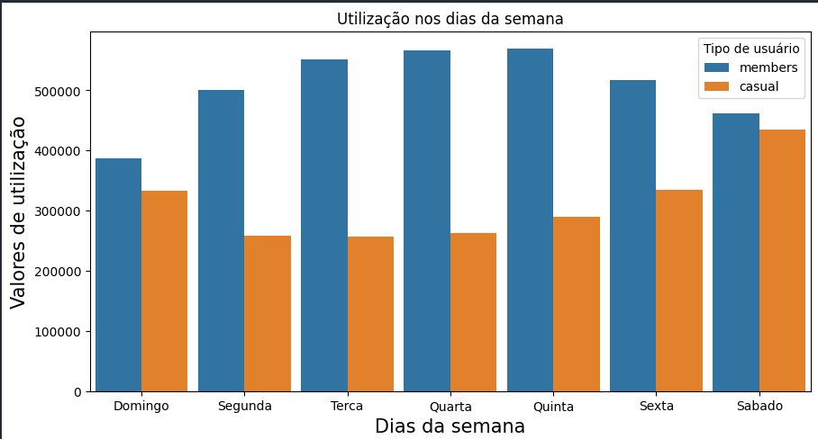
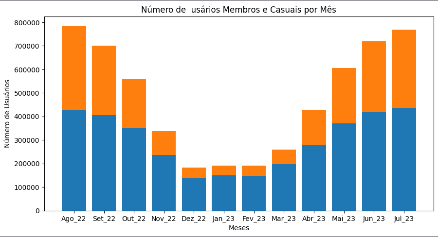

# Análise dos dados de uma empresa de bicicletas
#### Fábio Dias Rezende Carvalho
#### E-mail: fabior.carvalho@hotmail.com

Esse arquivo tem como objetivo fazer o trabalho de finalização do curso do google data analytics, baseado nos pedidos encontrados no arquivo 'src/estudo_de_caso_bicicletas.docx'. Os dados são encontrados [Nesse link](https://divvy-tripdata.s3.amazonaws.com/index.html), onde os dados são gerados pela empresa e disponibilizados para estudo, os dados aqui encontrados e a empresa cyclistic não são reais. Os caminhos do jupyter notebook indicam como os dados foram trabalhados, com o link é possivel acessa-los e salva-los com o mesmo nome, entretanto o git hub me impede de fazer o upload de dados acima de 100 mb.

# Cenário do projeto

A idéia é simular o trabalho de uma analista de dados júnior que atua na equipe de marketing da Cyclistic, uma empresa de compartilhamento de bicicletas de Chicago.
A equipe de marketing pede a respostas de três perguntas específicas:

* Como os membros anuais e os ciclistas casuais usam as bicicletas da Cyclistic de forma diferente?
* Por que os passageiros casuais iriam querer adquirir planos anuais da Cyclistic?
* Como a Cyclistc pode usar a mídia digital para influenciar os passageiros casuais a se tornarem membros?

# Conclusões da análise e insights da abordagem que recomendo para a parte interessada

Aqui temos que ter em mente que as três perguntas que deram o norte para minha análise:

* **Como os membros anuais e os ciclistas casuais usam as bicicletas da Cyclistic de forma diferente?**

Com nossa análise podemos notar que a média de tempo de utilização dos usuários casuais são 28 minutos, contra a média de 12 minutos dos usuários membros da empresa. Também temos uma mudança nítida pela utilização durante a semana, uma vez que a maior parcela de usuários casuais se encontra nos dias do fim de semana, sexta, sábado e domingo, logo, podemos definir que a utilização dos usuários casuais se relacionam muito mais com passeios e lazer do que os usuários membros, que tendem a utilizar as bicicletas mais durante os dias da semana. Além disso, temos esses valores muito diferentes durante os meses do ano, uma vez que os meses de verão, e seus dois meses adjacentes, encontram os maiores valores de usuários casuais durante o ano.

* **Por que os passageiros casuais iriam querer adquirir planos anuais da Cyclistic?**

Os usuários casuais poderiam utilizar os planos anuais se forem influenciados a começarem a ir trabalhar de bicicleta, mas é algo mais dificil de se influenciar com propagandas diretas da empresa, pois é um habito mais complexo de ser modificado. A utilização desses usuários ocorre em maior peso durante as estações do ano que possuem melhor temperatura para utilizar a bicicleta como um lazer, onde a motivação para  esses usuários se tornarem membros pode ocorrer pelo próprio incentivo da empresa, com o impulsionamento de marketing digital correto nas mídias digitais, as datas indicadas estão descritas abaixo, assim como incentivo financeiro para épocas do ano, por exemplo, uma promoção para os 5 meses do ano que são mais utilizados pelo usuários casuais, apesar de não ser um plano para o ano todo pode-se chegar a um maior lucro caso os usuários casuais assinem esse plano sazional da Cyclistic, onde essa promoção deve ser impulsionada nos meses abril, maio e junho, onde os usuários se sentiriam mais tentados a comprar esse pacote sazional por terem mais tempo para utilizar esse pacote.

* **Como a Cyclistc pode usar a mídia digital para influenciar os passageiros casuais a se tornarem membros?**

Os esforços por parte da Cyclistic em mídia digital deve levar em conta os comportamentos dos usuários durante o ano, então existe a possibilidade de impulsionar os anúncios em mídia digital da empresa durante os meses com melhor clima para os usuários (maio, junho, julho, agosto e setembro), que são os meses que mais usuários casuais utilizam o serviço da empresa. Também é interessante colocar esses anúncios focados nos dias da semana com mais usuários casuais, sendo sexta, sábado e domingo a recomendação para esses dias.